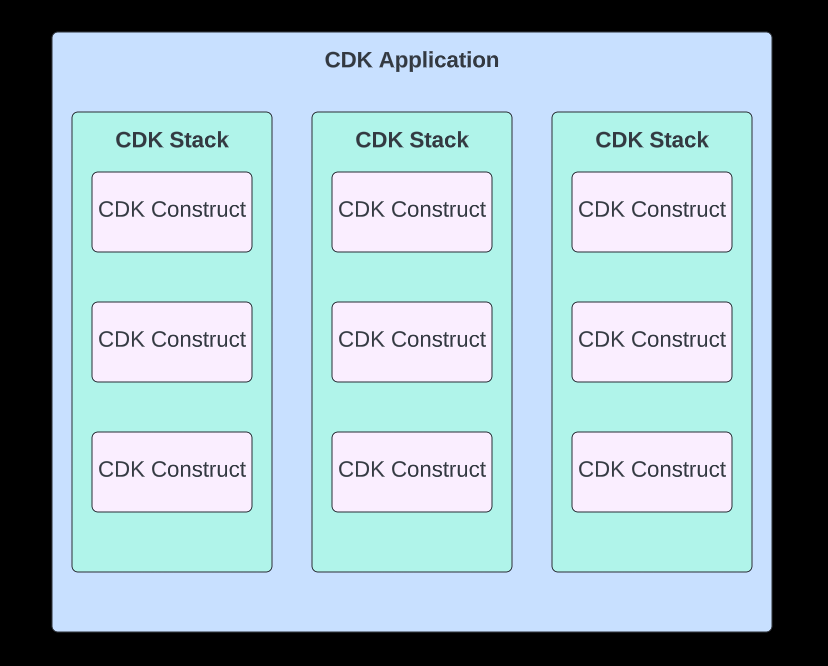
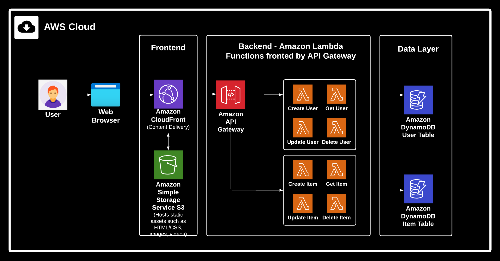
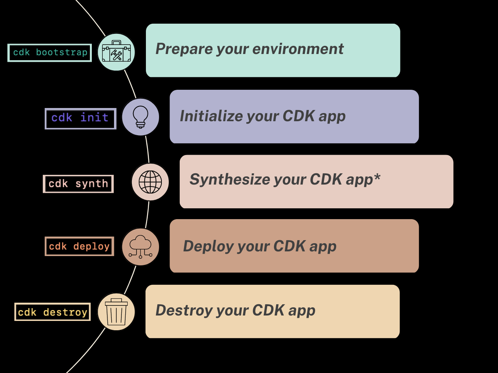

# Deploy a Serverless Web Application using the Amazon Cloud Development Kit (AWS CDK)

>***Author's Note:*** 
>The intended audience for this tutorial is developers, cloud architects, and DevOps professionals who already have a basic understanding of cloud computing and have an existing AWS account.  This tutorial also assumes a basic understanding of object oriented programming.

>I envision that this tutorial could be part one of a larger series where learners could eventually build out a full scale web application following the example architecture presented in the *CDK Project Structure* section of this tutorial.  

The [AWS Cloud Development Kit (AWS CDK)](https://aws.amazon.com/cdk/) is a framework used to define cloud infrastructure as code.  With the AWS CDK we can use our favorite object-oriented programming languages to build reliable, scalable, and secure applications in the AWS cloud without manually deploying infrastructure.

***In this tutorial we will learn:***
- The value proposition of the AWS CDK
- The bulding blocks of AWS CDK applications (Constructs, Apps, and Stacks)
- The basic structure of AWS CDK projects
- The lifecycle of a CDK application

Once we understand what the AWS CDK is all about, we will use our new CDK skills to deploy a website to the cloud!

**Estimated Time to Complete**: 10-15 min (not including prerequisites)

## Tutorial Pre-Requisites
- [ ] [Node.js (>= 10.13.0, except for versions 13.0.0 - 13.6.0)](https://nodejs.org/en)
- [ ] An [IDE](https://www.codecademy.com/article/what-is-an-ide) of your choice.  We will be editing code throughout this tutorial.  One great option is [VS Code](https://code.visualstudio.com/download).
- [ ] An active AWS Account and a basic understanding of [AWS regions](https://cloudacademy.com/blog/aws-regions-and-availability-zones-the-simplest-explanation-you-will-ever-find-around/).
- [ ] [AWS Command Line Interface (AWS CLI)](https://docs.aws.amazon.com/cli/latest/userguide/cli-chap-getting-started.html)
- [ ] The AWS CLI configured with credentials for an IAM user with the `AdministratorAccess` permission policy attached.  

## The Power of CDK

A CDK application defines a cloud application or cloud infrastructure configuration.  We can deploy the exact same CDK application one time or hundreds of times.  This functionality is powerful for several reasons:

- :shield: **security**: Define resuable components that are modeled to meet security best practices as well as your organization's security and compliance requirements.  Minimize human error by modeling and sharing vetted configurations via the CDK.
- :moneybag: **cost savings**: Use the AWS CDK to provision and destory entire cloud architectures within seconds.  Destroy cloud infrastructure when it's not needed to avoid paying for unnecesary resources.  Use the AWS CDK to re-deploy the exact same infrastructure in seconds when it's needed again.
- :detective: **best practices built in**: Create and reuse patterns built using cloud best practices.  Take advantage of 1000+ high-quality [existing, open-source CDK libraries](https://constructs.dev/) to deploy common cloud infrastructure patterns.

Imagine your company needs a complicated and highly secure networking architecture to be deployed in hundreds of different AWS cloud environments around the world.  Manually configuring and deploying this infrastructure hundreds of times will be time consuming, expensive, and prone to human error.  With the AWS CDK we can create one CDK application that models the network architecture perfectly. Our CDK application will be written to ensure every organizational security requirement is met.  We can then use this CDK application to deploy our networking resources in the exact same configuration in hundreds of accounts globally with a few simple commands.  If we need to update our configuration, we can use our CDK application to roll out the exact same update to every account at the same time.  We can even use our favorite CI/CD tooling to control this workflow.

Imagine our company operates in some countries year-round and some countries only for half of the year.  With CDK we can tear down and redeploy our networking infrastructure as often as we want and with very little effort.  We can save a lot of money by destroying our cloud resources whenever they are not being used.  We can also use automation to redeploy our CDK resources on a schedule or based on user demand signals with no human intervention needed. Now we are starting to see the power of the AWS CDK!

## Constructs, Stacks, and Apps

CDK applications are created using three important concepts: constructs, stacks, and apps.
- **Constructs**: Constructs are the building blocks of your CDK application.  A construct represents a *cloud component* that will be deployed in your cloud environment.  A cloud component could be one resource - such as one [Amazon S3 bucket](https://aws.amazon.com/s3/) - or a cloud component could resprent a higher-level abstraction such as an [application load balancer fronting containers running in the Amazon Elastic Container Service](https://docs.aws.amazon.com/solutions/latest/constructs/aws-alb-fargate.html).  CDK Constructs are powerful because they can be used to define common infrastructure patterns using best practices - once defined, CDK Constructs make best practice patterns easily sharable and repeatable.
- **Stacks**: Stacks are the unit of deployment in the AWS CDK.  Every AWS resource defined using a CDK construct must be definied within the scope of a stack.  When you deploy your CDK application you will choose whether to deploy every stack in the application, only certain stacks in the application, or even multiple copies of the same stack.
- **Apps**: A CDK application or app is a container for one or more stacks.  Stacks within the same CDK app can exchange information with one another.  A powerful feature of CDK is automatic dependency management between stacks - if one construct in Stack A is dependent on the deployment of a construct in Stack B - CDK will automatically deploy the stacks in the neccesary order to fulfill that dependency.  



> :bulb: A CDK application (or app) is a container for multiple stacks.  A CDK stack is a container for multiple CDK constructs.  CDK constructs represent a cloud component that will be deployed to your cloud environment.

Consider what this architecture could look like in practice.  Perhaps we want to host a [serverless web application](https://catalog.us-east-1.prod.workshops.aws/workshops/b0c6ad36-0a4b-45d8-856b-8a64f0ac76bb/en-US) in the cloud.  Here is an example of a typical serverless architecture:



> :bulb: This application is serverless because it can be built and maintained without provisioning and maintaining servers.  All server management is abstracted away by AWS.

Let's say we like this serverless architecture a lot and we know our team will want to deploy many similar architectures in the future.  Or maybe we need to deploy our serverless application seperately in several different countries.  Or maybe both!  Sounds like a perfect use case for the AWS CDK.  Below is an example of how we can organize our serverless web application into a CDK application using constructs, stacks, and apps.


> :bulb: Remember that when we deploy our application we can choose whether to deploy every stack or just some stacks.  We could deploy all three stacks first our first application deployment and then only re-deploy the Front End or Compute stack as needed during sebsequent deployments while leaving the database stack untouched.  

Apps, stacks, and constructs promote modularity and re-use.  If we wanted to deploy a different website with the same architecture, we could re-use the entire CDK application.   If we had a different application where we just needed a static website with no data store or compute logic we could re-use only our Front End stack from this CDK app with no problem. If we have an individiual construct perfectly configured to meet our security requirements we can easily plug that construct into countless other stacks and applications.

## CDK Application Lifecycle

We are about to build our first cdk application!  We will work with CDK using the command line interface.  Familiarizing yourself with common CDK commands is a great way to familiarize yourself with the overall lifecycle of a CDK application.  Take a moment to review the graphic below.  These commands are the same for Windows, Linux, and MacOS users.


* *note that CloudFormation is out of scope for this tutorial but an important tool to familiarize yourself with in order to build infrastructure as code expertise.  Check out the [CloudFormation User Guide](https://docs.aws.amazon.com/AWSCloudFormation/latest/UserGuide/Welcome.html) to learn more.*

## Let's Build a CDK App!

Now that we know what the AWS CDK is all about, let's get hands on and deploy our first CDK application!  In this lab we will use the AWS CDK to configure and deploy a simple static S3 website hosted in the AWS cloud. 
> :bulb: Remember to review the list of pre-requisites at the beginning of the tutorial.  Every pre-requisite is mandatory.

## Step 1: Configure Your Dev Environment
### Install the AWS CDK Toolkit
The AWS CDK Toolkit is a command-line utility that you will use to orchestrate your CDK applications.  Windows, Mac, and Linux users can install the CDK Toolkit by running the following command:

*(Note: Windows users should run this command as an Aministrator and Mac/Linux users should run this command using `sudo`)*

`npm install -g aws-cdk`

Verify your AWS CDK Toolkit installation by running 
`cdk --version`

### Select Your Programming Language
AWS CDK offers you the opportunity to model and deploy cloud infrastructure using your object-oriented programming language of choice - no need to learn new syntax!  CDK is currently available for TypeScript, JavaScript, Python, Java, C#, and Go with more languages to come.  

Depending on your choice of programming language, you may encounter additional prequisites.  For this tutorial we will be using Python and we need the following tools installed on our system:
- [ ] [Python version 3.6 or greater](https://www.python.org/downloads/)
- [ ] [Python package installer (pip)](https://pip.pypa.io/en/stable/installation/)

Verify your Python installation by running 
`python --version` or `python3 --version`

## Step 2: Create Your First CDK Application
### Intialize a CDK Project
Create an empty directory where your CDK application will live:
`mkdir cdk_static_website && cd cdk_static_website`

The `cdk init` command creates a new, empty CDK project.  Run `cdk init --help` to see the options available to us when we create a new project.  

For this tutorial we will create a new CDK project using a sample-app template and we will build our CDK application using Python.  Therefore, our `cdk init` command looks like this:

`cdk init sample-app --language python`

#TO-DO Example Output

Let's explore our new CDK Python application!
> If you havent already, now is a good time to open your IDE.  If you are using VS Code you can open the project directory in VS code by running `code .` 


As you can see, in the processes of initializing our project the CDK Toolkit has created several pre-configured files and directories for us.  For now we will focus on the most critical files.  [Read more about CDK project structure and components here](https://cdkworkshop.com/30-python/20-create-project/300-structure.html).
- ***app.py***: the entry point for our CDK application, similar to a "main" file.
- ***cdk_static_website/cdk_static_website.py***: a Python file that creates a custom CDK stack for use in your CDK application.  We will learn more about stacks when we model and deploy our application in step 4 of this tutorial.  A production CDK application will likely grow to have several different files defining several different stacks. 
- ***cdk.json*** A configuration file for CDK that defines several aspects of our application and how it should operate.  
- ***README.md***: A README describing our CDK application and basic deployment steps.  Notice we can find several useful tips and CDK commands prepopulated in the README by the CDK toolkit.  Eventually we should customize this README file to be specific to the CDK application we build.
- Notice that the CDK toolkit also initialized a ***git repository*** for us in the project directory and populated a .gitignore file that we can modify as needed.

### Activate our virtual environment and install required modules
Your project contains a .venv directory.  This .venv directory is used to create a Python virtual environment where we can install packages and run our Python application without impacting the Python installation on our system.  [Learn more about virtual environments here](https://docs.python.org/3/tutorial/venv.html).

Let's activate our virtual environment by running the following command, make sure to run this command from within your cdk_static_website/ directory.

Linux/MacOS:

`source .venv/bin/activate`

Windows:
`.venv\Scripts\activate.bat`

Once we have activated our virtual environment, we can install the required Python modules for our project by running

`pip install -r requirements.txt`

Now that we are familiar with our project structure and we have installed the required modules, we can get to work with CDK!

## Step 3: Bootstrap Your AWS Account

Our next step is to prepare our AWS environment for CDK deployments.  An AWS environment is a combincation of the AWS account and AWS region where we are provisioning our cloud resources.  We prepare our AWS environment using a process called CDK Bootstrap.  The CDK Bootstrap script will provision several resources in our AWS environment. CDK will rely on these resources behind the scenes when our CDK applications are being deployed.

Bootstrapping an AWS environment is a one-time process.  You will not need to run CDK Bootstrap again until you start deploying CDK applications in different AWS regions or a different AWS account.[Read more about CDK Bootstrap](https://docs.aws.amazon.com/cdk/v2/guide/bootstrapping.html)

Bootstrap your AWS environment by running: 

`cdk bootstrap`

Successful output will look like this:


## Step 4: Design our Application

Remember that the unit of deployment in the AWS CDK is called a ***stack***.  Within our CDK stacks we will use Python to define the resources we want to provision in the AWS cloud.  Let's get started by opening `cdk_static_website/cdk_static_website_stack.py`.  The file in it's current state will look something like this:


This example code will deploy two AWS resources: a [Amazon SQS Queue](https://aws.amazon.com/sqs/) and a [Amazon SNS Topic](https://aws.amazon.com/sns/).  Let's delete the existing code in `cdk_static_website_stack.py` and replace it with the following code block:

```
from constructs import Construct
from aws_cdk import ( 
    Stack,
    aws_s3 as s3, 
    aws_s3_deployment as s3_deploy
)

class CdkStaticWebsiteStack(Stack):

    def __init__(self, scope: Construct, construct_id: str, **kwargs) -> None:
        super().__init__(scope, construct_id, **kwargs)
        
        #create a s3 bucket to host our static website
        static_website_bucket = s3.Bucket(self, "StaticS3Bucket",
            public_read_access=True,
            block_public_access=s3.BlockPublicAccess(restrict_public_buckets = False),
            website_index_document='index.html',
            website_error_document='error.html'
        )

        #upload the html documents from s3-assets/ directory to the s3 bucket
        deployment = s3_deploy.BucketDeployment(self, "DeployWebsite",
            sources=[s3_deploy.Source.asset("../s3-assets")],
            destination_bucket=static_website_bucket
        )
```

This block of code imports several CDK modules and then uses those modules to model cloud infrastructure.  Specifcally, we are defining the CdkStaticWebsiteStack.  The CdkStaticWebsiteStack will include two constructs:
- a [S3bucket construct](https://docs.aws.amazon.com/cdk/api/v1/python/aws_cdk.aws_s3/Bucket.html) configured with the neccesary settings to support static website hosting.  This construct will create a new s3 Bucket to our AWS cloud environment.
> [Read more about S3 Buckets](https://aws.amazon.com/s3/)
- a [BucketDeployment construct](https://docs.aws.amazon.com/cdk/api/v2/python/aws_cdk.aws_s3_deployment/BucketDeployment.html) which is used to upload assets to our newly created bucket.  In this case we will use the BucketDeployment construct to upload the html files we want to serve from our bucket.

> :bulb: As we learn, we are copying and pasting existing code to get the feel of working with the CDK.  When you are designing and coding your own CDK applications you will use the [CDK API documentation](https://docs.aws.amazon.com/cdk/api/v1/python/modules.html) to make decisions about what code to write.  You can see examples of the CDK API documentation by clicking the S3Bucket construct and BucketDeployment construct links above.  

Open the `app.py` file located in the root of our project directory.  

We do not need to make any changes to `app.py` but let's take a look at what is going on here.  

`app.py` is the application entry point, meaning when we deploy our CDK application the deployment process will begin by running the code in `app.py`.

## Step 5: Synthesize and Deploy our Application
## Step 6: Update Your Application

Our s3 website is looking great so far.  

## Step 7: Destroy Your Application

## What to Build Next? 
- React App hosted in s3
- s3 behind API gateway with a lambda authenticator
- level 3 s3 website construct

## Become a Pro
- [AWS CDK on GitHub](https://github.com/aws/aws-cdk)
- [AWS CDK User Guide](https://docs.aws.amazon.com/CDK/latest/userguide)
- [The CDK Workshop](https://cdkworkshop.com/)
- [AWS CDK FAQs](https://aws.amazon.com/cdk/faqs/)